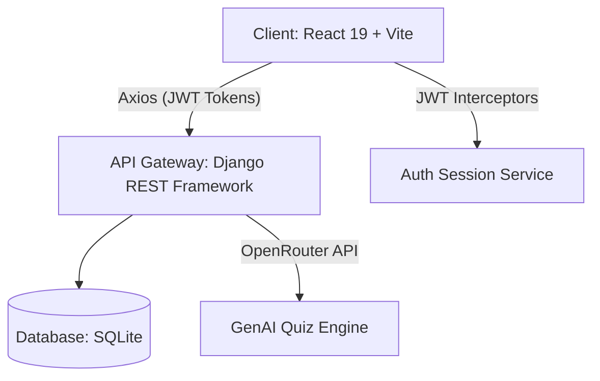

# 🎓 LearningHub — AI-Powered Online Learning Platform

LearningHub is a premium, full-stack, AI-powered Online Learning Platform that delivers an interactive educational experience. The platform features an intelligent backend powered by **Django & Django REST Framework (DRF)**, a highly interactive, modern client built with **Vite & React 19**, and a state-of-the-art **Generative AI Quiz Engine** powered by the **OpenRouter API**.

Designed around robust role-based workflows, LearningHub empowers **Students** to learn and test their knowledge, provides **Instructors** with absolute course-management control, and gives **Administrators** a unified interface to oversee the platform's user roster and enrollments.

---

## 🏗️ Platform Architecture

LearningHub employs a decoupled, client-server architecture:



- **Frontend Application**: Crafted using React 19, powered by Vite, and styled with high-fidelity, polished, responsive Vanilla CSS. Client-side authentication is secured using local storage and automated Axios request/response interceptors to seamlessly handle silent JWT token refreshing.
- **Backend API**: Engineered with Django 6.0 and Django REST Framework, leveraging Django REST Framework SimpleJWT for stateless, secure authentication.
- **Database Layer**: Standard relational model using SQLite (perfect for fast local deployment and testing).
- **AI Integration**: Connects dynamically to OpenRouter AI (with models like `openrouter/auto`) to design custom multiple-choice assessments.

---

## 🌟 Key Features & Role-Based Portals

### 👨‍🎓 1. Student Portal (Vibrant & Interactive)
- **Course Exploration & Enrollment**: Browse the entire catalog of public courses and enroll in one click.
- **Modern Lesson Player**: Watch instructional videos, download associated course documents (PDFs, docs), and track progress with an interactive checklist.
- **AI-Generated Quizzes**: Test understanding by generating real-time, custom 10-question multiple-choice quizzes on 8 different core disciplines.
- **Automated Score Sheets**: Answer questions and view immediate grades, color-coded correct/incorrect breakdowns, and detailed stats.

### 👩‍🏫 2. Instructor Control Center (Course & Material Management)
- **Course Creation & Design**: Upload thumbnails, write course descriptions, and structure course curriculum.
- **Curriculum Authoring**: Upload high-quality video files and register download-ready documents (PDFs, Docs, Videos) for specific lessons.
- **Student Tracker Dashboard**: Look at a comprehensive roster of enrolled students for each course, showcasing their real-time progress percentages and completion statuses.

### 👑 3. Admin Command Center (Platform Supervision)
- **System Metrics & Platform Stats**: View a card deck of real-time metrics (Total Users, Total Students, Total Instructors, Total Courses, Total Enrollments, and Course Completions).
- **User Directory**: Browse, filter, and audit every user on the platform.
- **Role Escalation**: Seamlessly elevate standard student accounts into instructors or administrators.
- **User Termination**: Instantly and permanently delete user accounts if they violate guidelines.
- **Enrollment Oversight**: Track platform-wide enrollment progress, watching student completion percentages in real time.

---

## 🧠 Generative AI Quiz Engine

The platform features an advanced, dynamic assessment generator powered by the **OpenRouter API**:

1. **Dynamic Prompting**: Instructors/Students trigger the generation of a challenging 10-question multiple-choice test by sending the desired subject to the API.
2. **Defensive Parsing & Validation**: The backend parses the LLM output, strips potential markdown wrappers (` ```json `), validates the JSON structure (guaranteeing 10 questions, exactly 4 choices each, and valid 0-3 answer keys), and gracefully recovers from network anomalies.
3. **High-Availability Fallbacks**: If the OpenRouter API key is missing or an outage occurs, the engine dynamically falls back to an offline bank of robust, expert-written quizzes across **8 key disciplines**:
   - 🗄️ **Database Management** (`db`)
   - 🤖 **Artificial Intelligence** (`ai`)
   - ☕ **Java Programming** (`java`)
   - 🐍 **Python Programming** (`python`)
   - 📊 **Finance & Accounting** (`finance`)
   - 📣 **Digital Marketing** (`marketing`)
   - 📈 **Business Analytics** (`analytics`)
   - 🤝 **Leadership & Strategy** (`leadership`)

---

## 📡 REST API Reference

### 🔐 1. Authentication & Profile APIs
| Method | Endpoint | Access Level | Description |
| :--- | :--- | :--- | :--- |
| **POST** | `/api/users/register/` | Public | Register a new user account (forces `student` role to prevent privilege escalation). |
| **POST** | `/api/users/login/` | Public | Log in with credentials; returns access/refresh JWT tokens and user metadata. |
| **POST** | `/api/token/refresh/` | Public | Refresh expired JWT access tokens using a valid refresh token. |
| **GET** | `/api/users/profile/` | Authenticated | Fetch details of the logged-in user (including bio, email, profile picture URL). |
| **PATCH** | `/api/users/profile/update/` | Authenticated | Update user information (supports file uploads for profile pictures and password hashes). |

### 📚 2. Courses & Curriculum APIs
| Method | Endpoint | Access Level | Description |
| :--- | :--- | :--- | :--- |
| **GET** | `/api/courses/` | Public | List all courses with titles, summaries, and student enrollment counts. |
| **POST** | `/api/courses/` | Instructor | Create a new course. Sets the creator as the course instructor. |
| **GET** | `/api/courses/<id>/` | Public | Get full details of a course, including all associated lessons. |
| **PUT/PATCH**| `/api/courses/<id>/` | Instructor | Update course details (only allowed for the course's instructor). |
| **DELETE** | `/api/courses/<id>/` | Instructor / Admin| Delete a course (Instructors can delete only their own courses; Admins can delete any). |
| **POST** | `/api/courses/lessons/create/` | Instructor | Add a new lesson (title, video file, order, duration) to a course curriculum. |
| **GET** | `/api/courses/lessons/<id>/materials/` | Authenticated | Retrieve lists of study documents (PDFs, docs, videos) for a lesson. |
| **POST** | `/api/courses/lessons/<id>/materials/` | Instructor | Upload a learning material file for a lesson (PDF, doc, or video format). |

### 🎓 3. Enrollments & Progress APIs
| Method | Endpoint | Access Level | Description |
| :--- | :--- | :--- | :--- |
| **POST** | `/api/enrollments/enroll/` | Student Only | Enroll a student in a course (automatically generates empty progress rows for lessons). |
| **GET** | `/api/enrollments/my-courses/` | Authenticated | Retrieve all enrolled courses for the logged-in student (includes overall progress). |
| **PATCH** | `/api/enrollments/complete-lesson/` | Student Only | Mark a lesson as completed; returns updated course progress percent. |

### 🧠 4. AI Quiz & Assessments APIs
| Method | Endpoint | Access Level | Description |
| :--- | :--- | :--- | :--- |
| **POST** | `/api/assessments/generate-quiz/` | Authenticated | Requests a dynamically generated AI quiz. Falls back to offline sets if API key is unset. |

### 👑 5. Administration & Stats APIs
| Method | Endpoint | Access Level | Description |
| :--- | :--- | :--- | :--- |
| **GET** | `/api/admin/stats/` | Admin Only | Retrieve platform analytics (total users, courses, completions, enrollments). |
| **GET** | `/api/users/all/` | Admin Only | Retrieve a detailed list of all registered platform users. |
| **PATCH** | `/api/users/<id>/role/` | Admin Only | Elevate or alter any user's role (`student`, `instructor`, `admin`). |
| **DELETE** | `/api/users/<id>/` | Admin Only | Permanently delete a user account from the system. |
| **GET** | `/api/enrollments/all/` | Admin Only | Retrieve all global enrollments, progress ratios, and completion statuses. |

---

## 💾 Database Schema

LearningHub uses Django’s built-in Object-Relational Mapper (ORM) to define structured relationships:

1. **`CustomUser`** *(Inherits from `AbstractUser`)*
   - `role`: Choices (`student`, `instructor`, `admin`).
   - `bio`: Plain text biography.
   - `profile_picture`: Optional file field (`profiles/`).
2. **`Course`**
   - `title`: Course header.
   - `description`: Text details.
   - `instructor`: ForeignKey to `CustomUser` (filtered to `role='instructor'`).
   - `category`: Classification string.
   - `thumbnail`: Optional image field (`course_thumbnails/`).
3. **`Lesson`**
   - `course`: ForeignKey to `Course` (cascading).
   - `title`: Lesson title.
   - `video_file`: Optional uploaded video (`lesson_videos/`).
   - `order_number`: Progression index.
   - `duration`: Expected time (e.g. "12 mins").
4. **`CourseMaterial`**
   - `lesson`: ForeignKey to `Lesson` (cascading).
   - `file`: Uploaded document file (`course_materials/`).
   - `material_type`: Choice field (`pdf`, `doc`, `video`).
5. **`Enrollment`**
   - `student`: ForeignKey to `CustomUser`.
   - `course`: ForeignKey to `Course`.
   - `is_completed`: Boolean completed flag.
   - *Constraint*: Composite unique index on `(student, course)`.
6. **`Progress`**
   - `enrollment`: ForeignKey to `Enrollment` (cascading).
   - `lesson`: ForeignKey to `Lesson` (cascading).
   - `is_completed`: Completion boolean.
   - `completed_at`: Timestamp of completion.
   - *Constraint*: Composite unique index on `(enrollment, lesson)`.

---

## 🚀 Getting Started & Local Setup

### 📋 Prerequisites
Ensure you have the following installed on your machine:
- **Python**: Version `3.10` or newer.
- **Node.js**: Version `18.0` or newer.
- **NPM** (Node Package Manager).

---

### 🐍 Step 1: Backend Setup (Django)

1. **Navigate to the workspace root**:
   ```bash
   cd Online_lear_plt
   ```

2. **Create and Activate a Python Virtual Environment**:
   *On Windows (Command Prompt / PowerShell):*
   ```powershell
   python -m venv venv
   .\venv\Scripts\activate
   ```
   *On macOS / Linux:*
   ```bash
   python3 -m venv venv
   source venv/bin/activate
   ```

3. **Install Dependencies**:
   ```bash
   pip install -r requirements.txt
   ```

4. **Set Up Backend Environment Variables**:
   Create a `.env` file in `Online_lear_plt/` (next to `manage.py`):
   ```env
   # Django Secrets
   DJANGO_SECRET_KEY=generate-a-secure-secret-key-here
   DJANGO_DEBUG=True

   # OpenRouter AI Configuration (Optional but recommended for dynamic quizzes)
   OPENROUTER_API_KEY=your-openrouter-api-key-here
   OPENROUTER_MODEL=openrouter/auto
   ```

5. **Run Migrations & Initialize Database**:
   ```bash
   python manage.py migrate
   ```

6. **Create an Administrative Superuser**:
   ```bash
   python manage.py createsuperuser
   ```
   *(Follow the terminal prompts to register your admin user. You can log into the standard Django admin console at `http://127.0.0.1:8000/admin/` with these credentials).*

7. **Start the Backend Server**:
   ```bash
   python manage.py runserver
   ```
   The backend API will boot up at **`http://127.0.0.1:8000`**.

---

### ⚛️ Step 2: Frontend Setup (Vite + React)

1. **Open a new terminal window** and navigate to the frontend directory:
   ```bash
   cd Online_lear_plt/frontend/frontend
   ```

2. **Install Node Packages**:
   ```bash
   npm install
   ```

3. **Set Up Frontend Environment Variables**:
   Create a `.env` file inside the nested frontend directory (`Online_lear_plt/frontend/frontend/`):
   ```env
   # API Root Endpoint
   VITE_API_URL=http://127.0.0.1:8000
   ```

4. **Launch the Development Server**:
   ```bash
   npm run dev
   ```
   Vite will compile assets and serve the frontend, typically at **`http://localhost:5173`** (or another port outputted in the terminal).

---

## 🧪 Testing and Verification

To verify that the setup is operational:
1. Open your browser and go to `http://localhost:5173`.
2. Register a new user (this account will default to the `student` role).
3. Try to:
   - Click the **Quiz** section on the homepage and run an AI-generated or offline quiz.
   - Log into the administrative console at `http://127.0.0.1:8000/admin/`, find your user account under **Custom Users**, and elevate your `role` to `instructor` or `admin` to inspect the respective dashboards.
   - Create a course as an instructor, add lessons, and upload course attachments.
   - Log in as a student to enroll and watch progress update in real time.

---

## 📄 License

This project is licensed under the terms of the **GNU General Public License (GPL) Version 3.0**. See the [LICENSE] file in the root folder for full text and terms.
